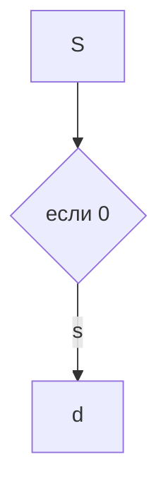

#evm 

|32 bit|20 bit|1 bit|1 bit|2 bit|8 bit|1 bit|1 bit|1 bit|1 bit|1 bit|
|-|-|-|-|-|-|-|-|-|-|-|
|Базовый адрес|предел|Р|S|PPL||A|G|D|X|U|

- A - бит доступности
	Раз в несколько минут система выставляет этот флаг в 0
	При доступе к сегменту выставляется в единицу
	
- S - означает, что сегмент системный
- PPL - 
