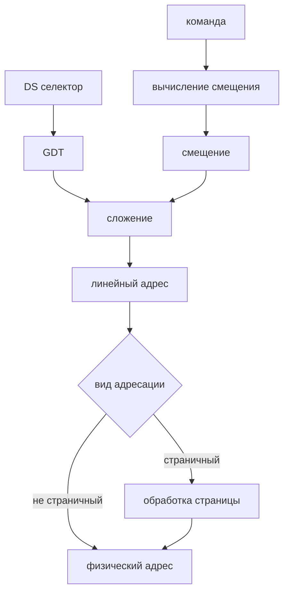

#evm 
1. Получаем команду
2. Вычисляем смещение
3. Получаем смещение

```mermaid
graph TD; 
	pc[команда] --> calc;
	calc[вычисление смещения] --> inset;
	selector[DS селектор] --> GDT;
	GDT --> calc2
	inset[смещение] --> calc2[сложение];
	calc2 --> linear[линейный адрес];
	linear --> type{вид адресации};
	type --> |страничный|page;
	type --> |не страничный|physic;
	page[обработка страницы] --> physic[физический адрес];
```