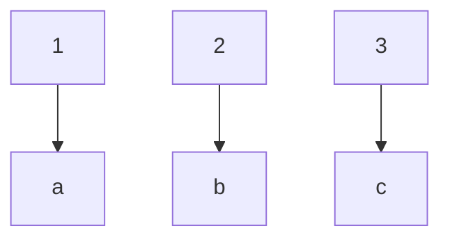
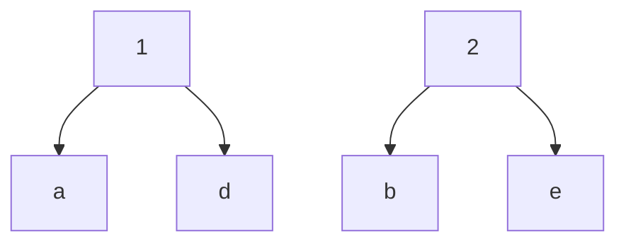
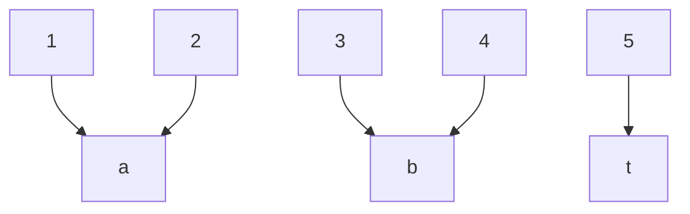
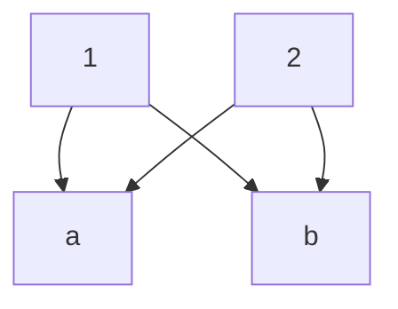

#dm  
Одно-однозначное

```mermaid
graph TD;
	1 --> a;
	2 --> b;
	3 --> c;
```

Одно-многозначное

```mermaid
graph TD;
	1 --> a;
	1 --> d;
	2 --> b;
	2 --> e;
	
```

Много-однозначное

```mermaid
graph TD;
	1 --> a;
	2 --> a;
	3 --> b;
	4 --> b;
	5 --> t;
```

Много-многозначное

```mermaid
graph TD;
	1 --> a;
	2 --> a;
	1 --> b;
	2 --> b;
```

[[Бинарное отношение]]